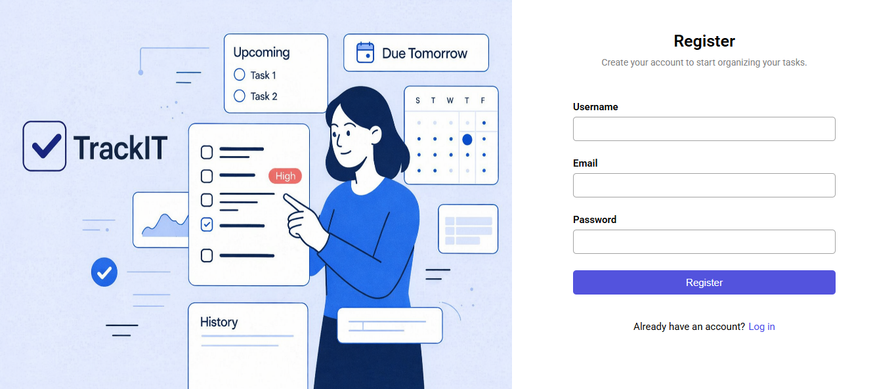
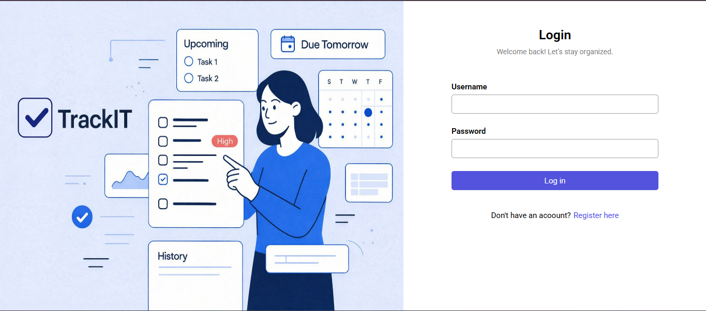
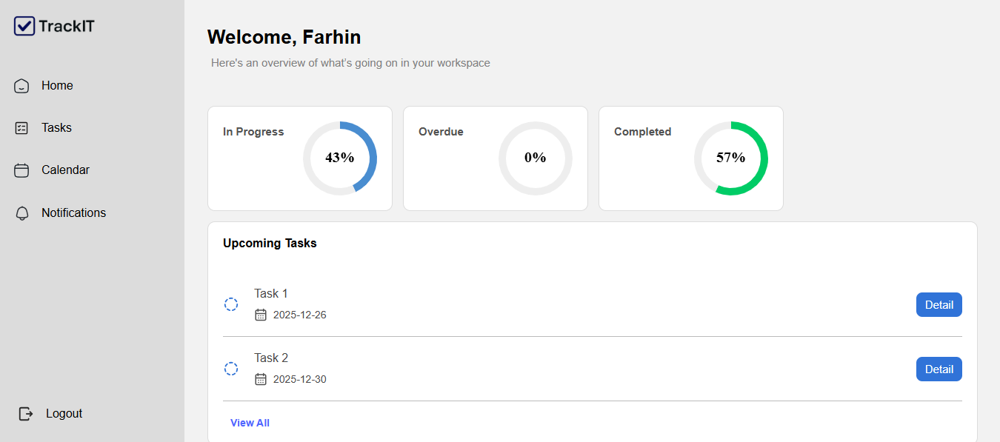
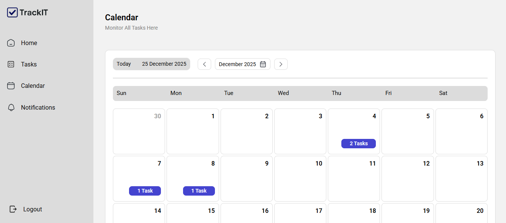
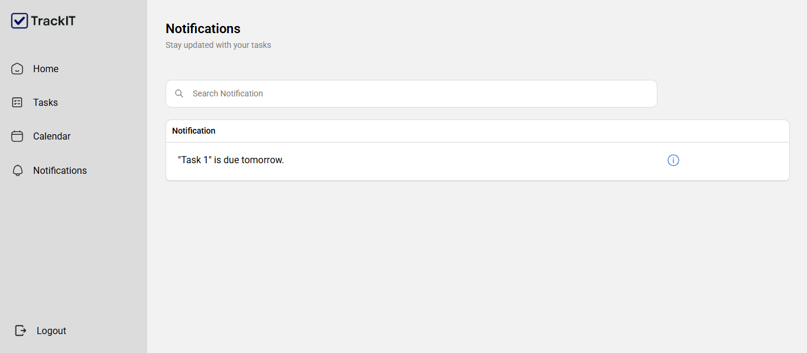

# TrackIT – Task Management Web Application

**TrackIT** is a full-stack web application using a layered architecture that emphasizes security, scalability, and maintainability. The backend is developed with **Spring Boot (MVC)** to ensure a clear separation of concerns across controllers, services, and repositories. **Spring Security** handles user authentication and authorization, ensuring that tasks and data remain private to each user. **Thymeleaf** is used as a server-side template engine to dynamically render HTML views and seamlessly integrate backend data into the frontend. The application uses **PostgreSQL** as a reliable relational database to persist users, tasks, notifications, and task history.

## Features

### Task Management

-   Create, edit, and delete tasks
    
-   Set task priority (Low, Medium, High)
    
-   Mark tasks as Completed
    
-   Task status automatically updates to **Overdue** when the deadline is crossed
    

### Subtasks

-   Create subtasks under each main task
    
-   Subtask creation, updates, and deletion are recorded in task history
    

### Task History & Activity Log

-   Each task maintains a complete activity history, including:
    
-   Task creation timestamp
    
-   Subtask added, edited, or deleted events
    

### Task Table

-   Tasks displayed in a structured table format
    
-   Pagination for improved performance and usability
    
-   Quick visibility of task status and priority
    

### Task Monitoring & Analytics

-   Monitor tasks by status:
    
-   In Progress
    
-   Overdue
    
-   Completed

-   Task analytics for productivity insights
    

### Deadlines & Reminders

-   View upcoming tasks due in the next 10 days
    
-   Receive reminders for tasks due tomorrow
    

### Calendar View

-   Monthly calendar view displaying the number of tasks due on each day
    
-   Navigate between months 
    
-   Click on any date to view all tasks due on that specific date
    
-   Easily identify busy days and upcoming deadlines
    

### Authentication & Security

-   Secure user authentication using Spring Security
    
-   Each user can only access and manage their own tasks

 

## Screenshots

### Register

### Login

### Home

### Tasks

### Calendar

### Notifications

 

## Future Enhancements

-  Send email notifications when a task deadline is near
    
-  Search and filter tasks by name, status and priority

- Progression bar for completed subtasks
    
